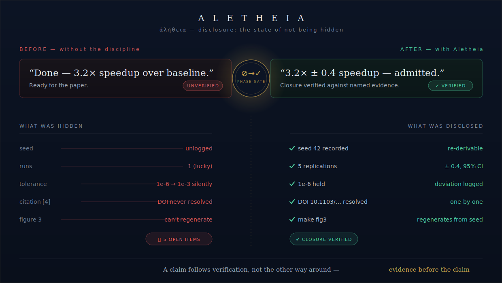

<p align="center">
  
</p>

<p align="center">
  <strong>Operating discipline for rigorous, reproducible computational-science research.</strong><br>
  <sub>A portable Agent Skills pack for Claude Code and Codex — discipline as instructions, not enforcement as scripts.</sub>
</p>

<p align="center">
  <em>ἀλήθεια — “disclosure; the state of not being hidden.”</em>
</p>

---

## Overview

**Aletheia** is a portable, open-source Agent Skills pack that encodes the *operating
discipline* of a results-producing computational-science project: where evidence lands, what
gates a “done” claim, how decisions propagate across a repository, and what a number must carry
before it enters a paper. It ships as **markdown only** — the pack is a set of runbooks an
agent (or a person) follows, not a framework to install — which makes it model- and
harness-portable by construction. It ships as a Claude Code plugin and as a native Codex
plugin. Non-markdown shipped files are limited to declarative manifests, marketplace
metadata, schema files, and presentation assets.

The library divides into **14 skills** (9 everyday-discipline *core*, 5 reproducibility-and-
positioning *extended*), a **generator** that binds the pack to a specific repository, and
three **read-only auditor agents**. A companion routing table maps each kind of work to the
discipline it triggers — with escalation conditions, so a small change never incurs heavy
ceremony.

<p align="center">
  <a href="https://claude.ai/code/artifact/83f5395e-a984-4391-85b7-18c8056ec7a6"></a>
</p>

<p align="center">
  <sub>A <strong>real</strong> case (<a href="examples/a2g-pathloss-3gpp.md">worked out here</a> · <a href="https://claude.ai/code/artifact/83f5395e-a984-4391-85b7-18c8056ec7a6">animated version</a>): an AI mixed 3GPP scenario parameters — surface-correct, a 10 dB error — and is held at the gate until every coefficient is traced to one scenario and one spec table.</sub>
</p>

<p align="center">
  <a href="https://claude.ai/code/artifact/5bfcc9ae-2530-47d3-b5ce-fcd938d31238"></a>
</p>

<p align="center">
  <sub>A second <strong>real</strong> case (<a href="examples/monte-carlo-pi.md">worked out here</a> · <a href="https://claude.ai/code/artifact/5bfcc9ae-2530-47d3-b5ce-fcd938d31238">animated version</a>): one lucky Monte-Carlo run claimed π to ±1×10⁻⁴; the 20 recorded runs scatter 30× wider (95% CI ±8.9×10⁻⁴), and the discipline directs the agent to hold the claim until the interval is reported and the seed logged.</sub>
</p>

## What you actually do (five steps)

1. **Install** — `claude plugin install aletheia@aletheia` (or trial one session with `--plugin-url`).
2. **Bind** — "run the skill-library-generator", answer two questions: which modules corrupt
   your results if silently wrong (`critical_modules`), and the one command that must pass
   before "done" (`gate_command`).
3. **Gate** — touch critical code → that command must be green before you call it done.
4. **Keep a run** — `results/<name>_<date>/meta.json`, with the expected outcome written
   *before* you launch.
5. **Close a milestone** — `phase-gate` verifies your written checklist against named artifacts.

Ten-minute tour: [`docs/quickstart.md`](docs/quickstart.md).

## Motivation

Computational results fail reproducibility for mundane, recurring reasons: an unpinned
dependency, an unlogged seed, a silently loosened test tolerance, a figure no one can
regenerate, a single lucky run reported as a finding, a citation that was never verified. None
of these are exotic; each is a discipline gap that a senior researcher normally patches by
habit and memory. Aletheia writes those habits down as checkable procedures so that a lab
member — or an AI agent working in the repository — inherits them on day one rather than
relearning them after the damage is in the manuscript.

The pack is deliberately **provenance-first and honesty-first**. Its governing rules —
ground-truth over assertion, derived state over stored state, evidence before a claim — are the
same standards a careful methods section must meet, applied continuously during the work rather
than reconstructed at submission time.

## What ships

**14 skills · 1 generator · 3 agents · 5 templates · 6 docs · worked examples across five
domains.**

### Core skills (9) — everyday discipline

| Skill | One line |
|---|---|
| `project-layout` | one home per artifact class (notebook vs. script vs. package placement + notebook-series discipline); bulk directories gitignored, their records tracked |
| `layer-sync` | decisions → spec → code → notebooks stay in agreement; drift gets file:line citations |
| `decision-log` | numbered ADR-lite chain, newest on top; superseded entries never deleted |
| `build-log` | write-once phase/gate evidence entries — the paper's raw methods material |
| `phase-gate` | closure = a written checklist verified against named evidence; one OPEN item = no closure |
| `correctness-gate` | a critical module is touched → the named gate must pass before “done” |
| `canonical-params` | protected defaults change only inside a sweep or with approval and a record |
| `run-provenance` | engine/arch fingerprint + input hashes + re-derivable seeds — everything `meta.json` must record about a run |
| `evidence-convention` | no dark runs: `results/<name>_<date>/meta.json` with pre-registered expectations |

### Extended skills (5) — reproducibility & positioning · `status: recommended`

| Skill | One line |
|---|---|
| `statistical-reporting` | never report a single run; replication + intervals + visible denominators |
| `numerical-determinism` | threads/kernels pinned where claimed; hardware context recorded; reproducibility tiers named |
| `negative-results-ledger` | dead ends leave a one-line record; rigorous negatives get promoted, not buried |
| `external-positioning` | novelty book-kept; claims scoped to the evidence that supports them; every kept figure regenerates from one command |
| `lit-anchor` | AI fabricates citations — resolve every DOI one-by-one; a bulk citation list is a draft, never a result |

### Generator & agents

- **`skill-library-generator`** — binds the pack to your repository by interview (a config
  block in `CLAUDE.md`) and mines your project's own failure modes into local skills. The
  invoking agent is the runtime; there is no bootstrap script.
- **`session-historian`** (state digest from the record) · **`drift-auditor`** (layer-sync
  audit) · **`verifier`** (adversarial refutation of load-bearing claims). All three are
  read-only reporters — they write nothing, ever.

## How it works

```bash
# try it for a single session
claude --plugin-url https://github.com/huguryildiz/Aletheia
```

Install persistently — marketplace name and plugin name are both `aletheia`, so the install
target is `aletheia@aletheia`:

```bash
claude plugin marketplace add huguryildiz/Aletheia
claude plugin install aletheia@aletheia
```

Codex CLI uses the same marketplace idea:

```bash
codex plugin marketplace add huguryildiz/Aletheia
codex plugin add aletheia@aletheia
```

Inside your project, invoke *“run the skill-library-generator.”* It scans the repository
read-only, interviews you to fill the configuration bindings, and — only after your approval —
scaffolds the record surfaces. Each skill thereafter refers to those bindings (`{{gate_command}}`,
`{{critical_modules}}`, `{{doc_layers}}`, …) rather than any hardcoded path, so the same
discipline reads naturally whether the project runs a solver, a climate model, a training loop,
or none of the above.

**Manual install** (no plugin marketplace, no Claude Code plugin system — just files). Plain
`.claude/skills/` discovery is one level deep, so flatten the core/extended grouping when you
copy:

```bash
# from the aletheia checkout, inside your project:
cp -R aletheia/skills/core/*                  .claude/skills/
cp -R aletheia/skills/extended/*              .claude/skills/
cp -R aletheia/skills/skill-library-generator .claude/skills/
cp    aletheia/agents/*.md                    .claude/agents/
```

Then invoke *"run the skill-library-generator"* — skill names are unchanged (they come from
frontmatter); only the `aletheia:` namespace prefix is absent compared to the plugin path.

**Ten-minute tour:** [`docs/quickstart.md`](docs/quickstart.md) · **full install reference**
(plugin vs. manual, in detail): [`docs/install.md`](docs/install.md) · **full adoption
walkthrough:** [`docs/adopting-in-a-new-project.md`](docs/adopting-in-a-new-project.md).

## Design principles

1. **Ground-truth only** — core runbook steps were harvested from a working repository;
   extended steps were authored from canon and grounded where that repository practiced them
   (see [core-vs-extended.md](docs/core-vs-extended.md)). Inference is labeled as inference,
   and a wrong runbook is worse than none.
2. **State is derived, not stored** — no mutable status file anywhere; gate verdicts live in
   immutable evidence (run metadata, build-log closures, tags) and are recomputed.
3. **No source mutation** — the agents are read-only reporters; every write is a skill action a
   human sees and authorizes.
4. **Markdown only** — the discipline is instructions, not code; non-markdown shipped files
   are declarative manifests/catalogs/schema plus presentation metadata.

Full text and the portability gate: [`docs/design-principles.md`](docs/design-principles.md) ·
tier semantics and the work-type routing table:
[`docs/core-vs-extended.md`](docs/core-vs-extended.md).

## Provenance & portability

The core skills were **generalized from the operating rules of one real computational-research
repository** and stress-tested until they read naturally in domains with no shared machinery.
That source project's identity and vocabulary are deliberately excluded from the shipped pack: a
**CI portability gate** (denylist in [`docs/portability-vocab.txt`](docs/portability-vocab.txt))
requires that `skills/` and `templates/` contain **zero domain terms**. Concrete
instantiation lives only in [`examples/`](examples/) — five fictional worked examples (deep
learning, variational quantum algorithms, climate-ensemble calibration, molecular-dynamics free
energy, and plasma simulation) plus a ten-domain portability matrix, included to demonstrate that
only the nouns change.

## Repository map

```text
skills/core/…             9 everyday-discipline skills
skills/extended/…         5 reproducibility & positioning skills
skills/skill-library-generator/   the binder/generator meta-skill
agents/                   3 read-only auditor agents
plugins/aletheia/         Codex plugin root (symlinked skills + .codex-plugin/plugin.json)
.agents/plugins/          Codex repo marketplace catalog
templates/                CLAUDE.md config + routing, decisions skeleton, run-metadata schema
docs/                     install · quickstart · adoption · core-vs-extended · design-principles · decisions
examples/                 5 worked examples + portability matrix
.claude-plugin/            Claude Code plugin manifest + marketplace metadata
```

## Citation

```bibtex
@software{yildiz_aletheia_2026,
  author  = {Yildiz, Huseyin Ugur},
  title   = {Aletheia: Operating Discipline for Rigorous, Reproducible
             Computational-Science Research},
  year    = {2026},
  version = {0.2.0},
  url     = {https://github.com/huguryildiz/Aletheia}
}
```

## License

[MIT](LICENSE) © 2026 Hüseyin Uğur Yıldız
