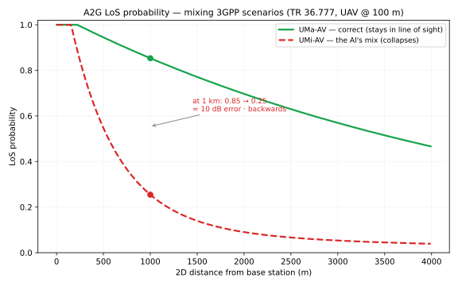

# A2G path-loss — a correctness gate against a named authority (3GPP)

A single-file, runnable model of the air-to-ground (A2G) propagation for a cellular-connected
UAV, per **3GPP TR 36.777** (Tables B-1 / B-2). It is the runnable companion to the worked
example [`../a2g-pathloss-3gpp.md`](../a2g-pathloss-3gpp.md), and the strongest of the three
real examples: its gate checks **correctness against published ground truth**, not just
reproducibility.

## The failure it catches

An AI-generated model computed path loss with the **UMa-AV** formula but pulled the
LoS-probability coefficients from the **UMi-AV** row — both are valid 3GPP values in adjacent
rows, so nothing looks wrong on inspection. At 1 km it flips LoS probability 0.85 → 0.25, a
~10 dB total-loss error, physically backwards for a high-altitude UAV.



## Run

```bash
python3 model.py                 # write solutions.csv (P_LOS, total loss vs distance)
python3 model.py --check         # the gate — pure stdlib, no dependencies, runs anywhere
pip install -r requirements.txt  # only for the figure:
python3 plot.py                  # regenerate los-probability.svg / .png
```

## The gate — correctness, not reproducibility

`python3 model.py --check` verifies two things and exits 0 (pass) / 1 (fail):

1. **Scenario consistency** — every propagation coefficient names ONE scenario
   (`PL_SCENARIO == LOS_SCENARIO`).
2. **Ground truth** — the computed LoS probability and total loss match
   [`expected.json`](expected.json) at each test distance, whose values were verified against
   3GPP TR 36.777 (see the worked example's *Provenance*).

Set `LOS_SCENARIO = "UMi-AV"` in `model.py` to reproduce the real bug: the gate fails on
**both** counts — scenario mismatch, and every value diverges from the 3GPP ground truth
(P_LOS 0.85 → 0.25 at 1 km). Restore it → pass. That is a correctness gate anchored to a
named external authority — the thing a τ-reproducibility gate (see the UWSN example) cannot do.
