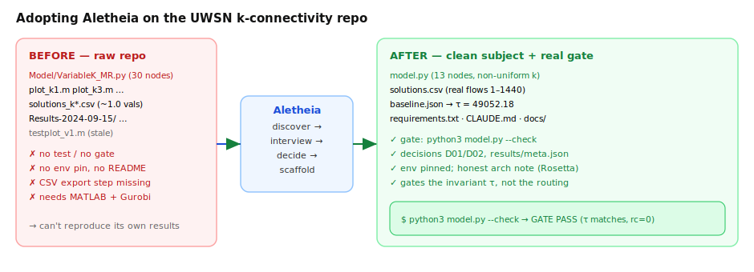
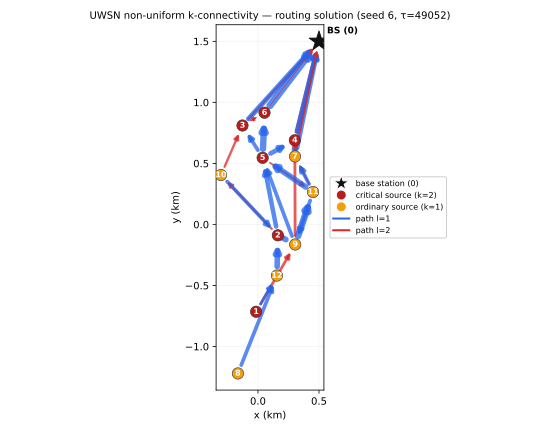

# UWSN non-uniform k-connectivity — clean worked example

A single-file, runnable MILP that computes energy-minimizing, **non-uniform
k-connected** routing for an underwater sensor network (UWSN). It is a faithful,
reduced reimplementation of the model behind the published paper "Mitigating Energy
Cost of Connection Reliability in UWSNs Through Non-Uniform k-Connectivity"
([IEEE doc 11143186](https://ieeexplore.ieee.org/abstract/document/11143186)) — the
physics (Thorp acoustic absorption, distance-tiered transmit
energy, node-disjoint multi-path routing, interference-aware bandwidth) is preserved;
the topology is reduced to 13 nodes and a fixed seed + a solution export + a fast
correctness gate are added so it runs end-to-end quickly and reproducibly.

This is the subject repo of Aletheia's end-to-end adoption example — see
[`../adoption-transcript.md`](../adoption-transcript.md) and `CLAUDE.md` here.

## Adoption at a glance



## The routing solution

`python3 plot.py` regenerates this figure from `solutions.csv` (echoes the paper's own
network figure): base station (★), critical sources (red, k=2) and ordinary sources
(orange, k=1), with data-flow edges coloured by path.



## Run

```bash
pip install -r requirements.txt          # needs a Gurobi license (free for academics)
python3 model.py                         # solve → write solutions.csv + baseline.json
python3 model.py --check                 # the gate: re-solve, compare tau to baseline
python3 plot.py                          # draw network.svg / network.png from solutions.csv
```

- `model.py` — constants at the top, then topology → MILP → solve → export.
- `solutions.csv` — the per-edge data-flow solution (`i,j,k,l,val`), one optimal routing.
- `baseline.json` — the **gated invariant**: the objective `tau` (max per-node energy).

## Why the gate checks `tau`, not the CSV

The routing optimum is **not unique** — many different flow assignments achieve the same
minimum `tau`, and a parallel solver returns different ones across runs. So byte-comparing
`solutions.csv` would fail on a solver tie-break, not a real regression. The reproducible,
scientifically meaningful invariant is the objective `tau`, so that is what
`python3 model.py --check` gates (relative tolerance 1e-6). `solutions.csv` is committed as
one illustrative optimal routing.

## Non-uniform k-connectivity

Critical sources (node index below `NODE*RATE`) must keep `K_HIGH=2` node-disjoint paths
to the base station; the rest keep `K_LOW=1`. Assigning connectivity non-uniformly — more
reliability only where it is needed — is the paper's contribution and what lets the network
save energy versus forcing every node to a uniform high k. See `docs/decisions.md` D02.
